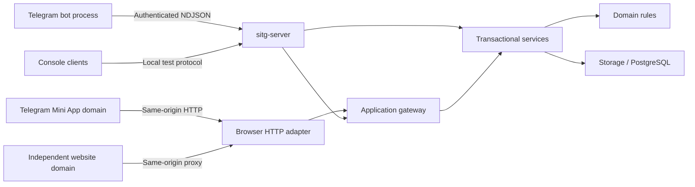

# Architecture and Developer Guide

Start with the [README](../README.md) for the product baseline and
[project configuration](database-operations.md) for runtime and database constraints. This document owns the
code map and shared development rules; each subsystem guide owns its implementation details.
[Planned features](future-work.md) is the inventory of remaining work.

## Runtime and dependency boundaries

The Python 3.12+ backend uses asyncio, SQLAlchemy/asyncpg, and PostgreSQL. The Telegram
process uses aiogram; the optional HTTP adapter uses aiohttp and runs inside
`sitg-server`. The Mini App uses TypeScript with Vite and direct DOM rendering in `web/`.
The website is an independent frontend project in the sibling `SITGBot-website` directory,
with its own build and documentation. The frontends share backend services, not frontend code.

PostgreSQL owns persistent state. The server runs game transitions, matchmaking, jobs,
and delivery queues. Telegram is a presentation client and never constructs a database
engine. Console commands have their own server dispatch path and share the same services;
they do not all pass through the typed gateway.

## Code and documentation map

All Python paths below are relative to [src/sitg_bot](../src/sitg_bot).

| Area | Entry points | Implementation guide |
| --- | --- | --- |
| Application boundary, identity, delivery | `application/`, `server.py`, `services/players.py`, `services/reliable_*.py` | [Application services and protocol](application.md) |
| Telegram routing, state, gameplay, chat | `bot/`, `services/telegram_game.py`, `services/chat.py` | [Telegram adapter](telegram.md) |
| Browser UI and HTTP | `miniapp_http.py`, [web/src](../web/src) | [Mini App](mini-app.md) |
| Tournament roles, registration, policy, access | `services/tournaments.py` | [Tournaments](tournaments.md) |
| Packet import, publication, revisions, authorship | `domain/packet.py`, `services/packets.py`, `storage/packets.py` | [Packet administration](packet-administration.md) |
| Assembly, validation, exposure planning, matching | `services/matchmaking.py`, `services/ruleset_content.py` | [Lobbies and assignment](lobby-architecture.md) |
| SI progression, answers, scoring, appeals | `domain/game*.py`, `services/persistent_game.py` | [Game rulesets and execution](game-rulesets.md) |
| Persistence and cross-cutting invariants | `storage/models.py`, `storage/database.py`, [migrations](../migrations) | [Data model and invariants](data-rules.md) |
| Rating, trust, analytics, privacy helpers | `domain/rating.py`, `services/trust.py`, `services/privacy.py` | [Ratings, trust, and statistics](data-and-statistics.md) |
| Startup, migrations, diagnostics, tests, CLI tools | `config.py`, `__main__.py`, [pyproject.toml](../pyproject.toml) | [Development and operations](database-operations.md) |
| Interactive console | `client.py`, `server.py` | [Console user guide](console-commands.md) |

## Follow a change through the code

1. A presentation adapter authenticates the caller and translates input into an operation.
2. The gateway validates the contract, authorization, request metadata, and retry identity.
   Console dispatch performs its corresponding session and command checks.
3. A service opens a transaction, locks affected records, checks current permissions and
   versions, applies domain rules, and records state changes and relevant events.
4. The response provides the authoritative projection. Durable consumers deliver notices;
   scheduled jobs resume time-dependent work after process restarts.

For a concrete game start, follow `LobbyService` in `services/matchmaking.py` into the
ruleset/content adapter and `PersistentGameService`. The transaction validates the lobby,
stores an immutable assignment plan, reserves exposure claims, creates execution rows, and
closes lobby membership. Recovery uses that stored plan.

## Development guidelines

- Keep rules in `domain/`, database-backed use cases in `services/`, and rendering/input
  concerns in adapters. Follow existing transaction boundaries; avoid moving logic merely
  to reorganize files.
- Treat tournament type, tournament policy, ruleset, and game host as separate concerns.
  Restrictions compose by intersection. SI is the only registered ruleset; its execution
  tables are still SI-specific.
- Pass explicit tournament context. Check permissions in services even when the UI hides
  the action. A manager role is scoped; a requested UI mode grants no authority.
- Preserve assigned snapshots, immutable published revisions, append-only corrective
  ledgers, and global exposure uniqueness. Read [data rules](data-rules.md) before changing
  lifecycle, content, or results.
- For new gateway mutations, define a typed versioned operation, authorization, idempotency,
  concurrency behavior, error mapping, and adapter projection. Keep Telegram IDs and private
  registration details out of public projections.
- Use durable jobs for deadlines and the transactional outbox for retryable delivery.
  In-memory timers, callbacks, and socket connections cannot be the recovery authority.
- Add new ordered Alembic migrations for schema changes; do not modify the frozen baseline
  or import live ORM metadata into migrations.
- Keep patches focused and avoid new dependencies unless needed. Run the relevant unit
  tests first, then PostgreSQL integration tests for persistence/concurrency changes and
  browser tests for UI changes. Database test constraints are in the operations guide.
- Update the owning document when behavior changes. Move completed features out of
  [planned features](future-work.md); do not create parallel status inventories.
